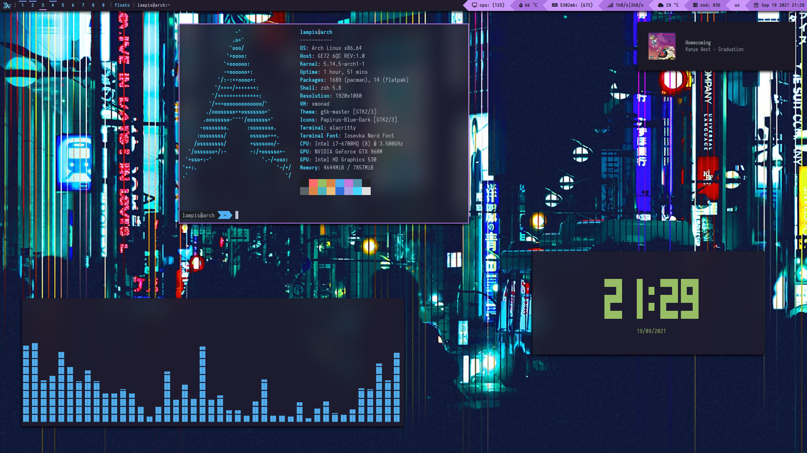
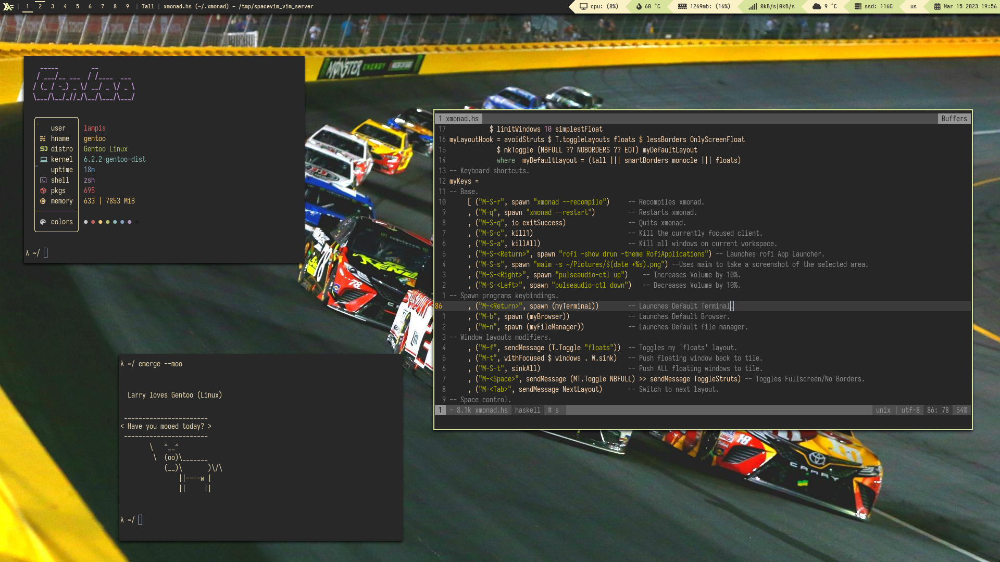
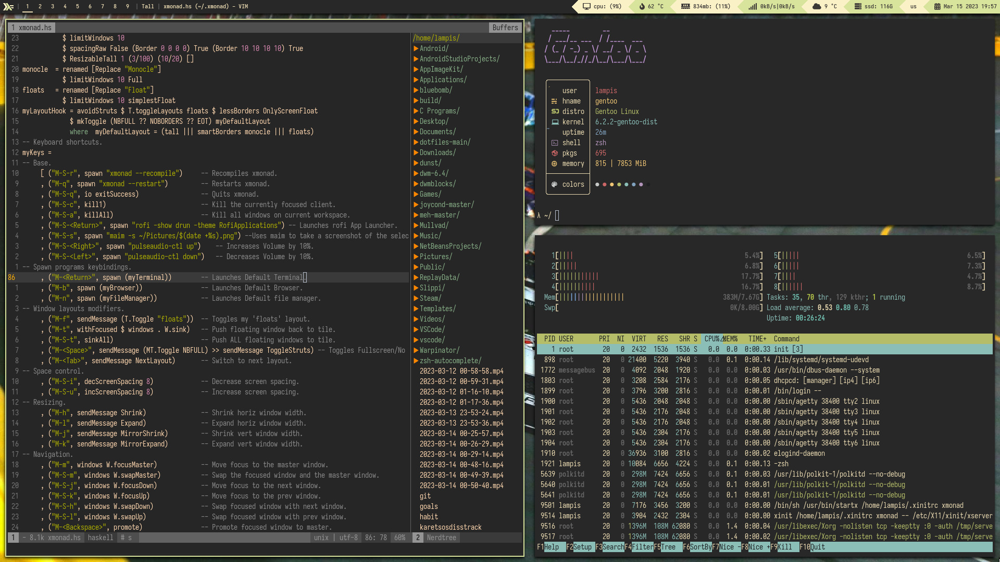

# My xmonad configuration
 My mostly yoinked dotfiles for my xmonad. This repo is mostly meant for me to store my configs for easy access but feel free to use them.

### Prerequisites: 

 Xmonad, xmonad-contrib and xmobar from the Arch repos are old and the git versions from the AUR seem to cause problems.
I recommend installing these packages with stack, [here's how.](https://brianbuccola.com/how-to-install-xmonad-and-xmobar-via-stack/)

On Gentoo Linux, compile xmobar with the xpm and xft USE flags.

### Screenshots

### OS: 
Gentoo Linux

### Window Manager: 
xmonad 

### Bar: 
xmobar

### Prompt: 
rofi

### Font: 
Iosevka

### Colorscheme: 
Gruvbox Dark

### Icons: 
Mint-Y Legacy

### Terminal: 
kitty

### Shell: 
fish

### Editor:
[SpaceVim](https://spacevim.org/)

### Compositor: 
picom

### Wallpaper applier: 
feh

### Notifications: 
Dunst

### Misc software that I use:
mpv, maim, MuPDF, nemo, OBS, Vscodium

### Contact Info:

Discord: Lamampis#2521

Mail: lampis750@tutanota.com
