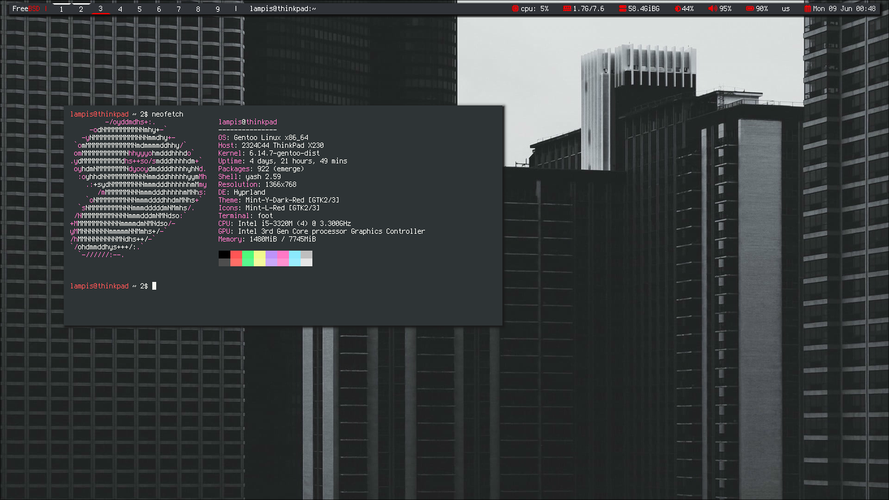

# My XMonad and Hyprland configuration
My dotfiles for my XMonad & Hyprland. This repo is mostly meant for me to store my configs for easy access but feel free to yoink them. 
I try to keep my files easily readable and editable. I recently switched over to hyprland, it's a great window manager. My configs for both window managers are very similar. I only use hyprland nowadays, but my old configs for xmonad will still be available here.

### Prerequisites: 
Xmonad, xmonad-contrib and xmobar from the Arch repos are old and the git versions from the AUR seem to cause problems.
I recommend installing these packages with stack, [here's how.](https://brianbuccola.com/how-to-install-xmonad-and-xmobar-via-stack/)

On Gentoo Linux, compile xmobar with the `xpm` and `xft` USE flags.

### Screenshots

## XMonad (On workstation laptop)

## Hyprland (on my X230 Thinkpad)

### OS: 
Gentoo Linux

### Window Manager: 
xmonad, hyprland

### Bar: 
xmobar, waybar

### Search Prompt: 
tofi

### Font: 
Iosevka, Terminus

### Colorscheme: 
[Gruvbox Dark](https://github.com/jmattheis/gruvbox-dark-gtk), Mint-Y-Red (from Linux Mint)

### Icons: 
Mint-L Legacy, Haiku

### Terminal: 
foot

### Shell: 
yash

### Editor:
Neovim (NVChad), mousepad

### Compositor: 
picom

### Wallpaper applier: 
feh, waypaper/swww

### Notifications: 
Dunst

### Misc software that I use:
mpv, maim, MuPDF, nemo, wf-recorder, grim+slurp, Obsidian, LibreOffice, tlp, doas, imv

### Contact Info:
Discord: lamampis

Mail: lampis750@tutanota.com
