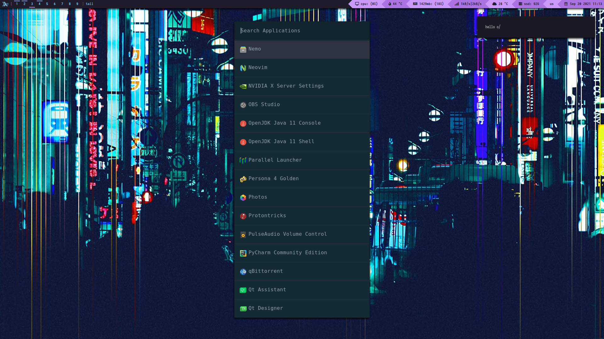

# My xmonad configuration
 My mostly yoinked dotfiles for my xmonad. Feel free to copy them.

### Screenshots

### OS: 
Arch Linux

### Window Manager: 
xmonad 

### Bar: 
xmobar

### Prompt: 
rofi

### Font: 
Iosevka Nerd Font

### Colorscheme: 
Dracula

### Icons: 
Papirus

### Terminal: 
alacritty

### Shell: 
zsh

### Compositor: 
picom-ibhagwan-git

### Wallpaper applier: 
nitrogen

### Notifications: 
Dunst
