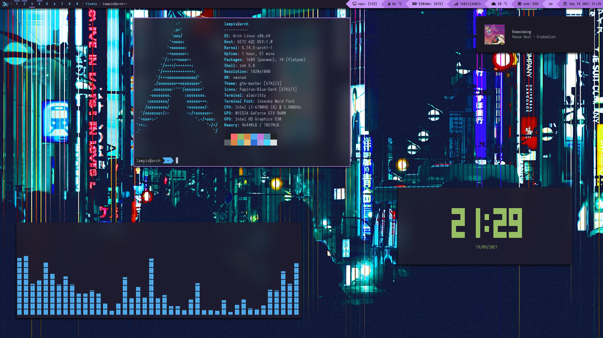
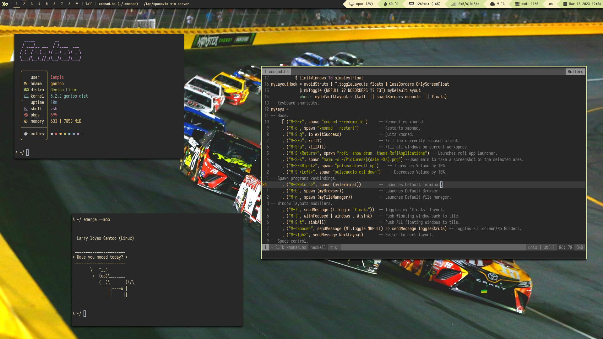
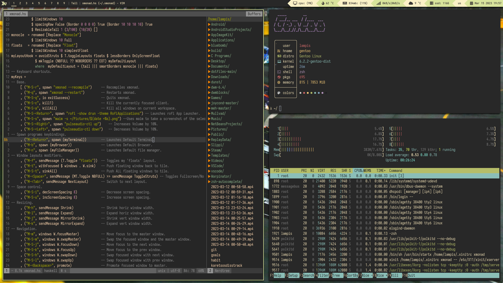
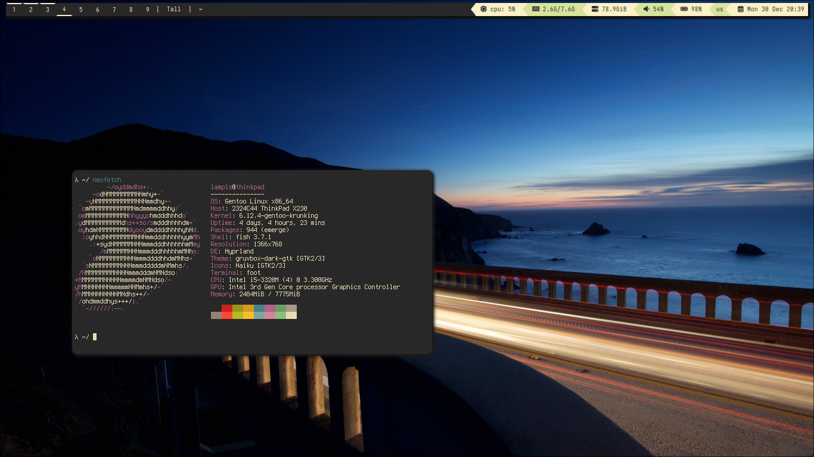

# My xmonad and hyprland configuration
 My mostly yoinked dotfiles for my xmonad. This repo is mostly meant for me to store my configs for easy access but feel free to use them. 
I recently switched over to hyprland, it's a great window manager. My configs for both window managers are very similar. I only use hyprland nowadays, 
but my old configs for xmonad will still be available here.

### Prerequisites: 

 Xmonad, xmonad-contrib and xmobar from the Arch repos are old and the git versions from the AUR seem to cause problems.
I recommend installing these packages with stack, [here's how.](https://brianbuccola.com/how-to-install-xmonad-and-xmobar-via-stack/)

On Gentoo Linux, compile xmobar with the `xpm` and `xft` USE flags.

## Kernel
 I use a custom kernel for my Thinkpad X230 Gentoo installation, it uses LZ4 to compress the kernel and the initramfs. For me, I have to add the line `compress="lz4"` to the file `/etc/dracut.conf.d/myflags.conf` and compile `sys-kernel/installkernel` with the `dracut` USE flag. It might slightly improve battery life over the dist kernel.

### Screenshots

## XMonad (On workstation laptop)

## Hyprland (on my X230 Thinkpad)

### OS: 
Gentoo Linux

### Window Manager: 
xmonad, hyprland

### Bar: 
xmobar, waybar

### Prompt: 
tofi

### Font: 
Iosevka, Terminus

### Colorscheme: 
[Gruvbox Dark](https://github.com/jmattheis/gruvbox-dark-gtk)

### Icons: 
Mint-Y Legacy, Haiku

### Terminal: 
kitty, foot

### Shell: 
fish

### Editor:
Vim, Neovim (NVChad)

### Compositor: 
picom

### Wallpaper applier: 
feh, hyprpaper

### Notifications: 
Dunst

### Misc software that I use:
mpv, maim, MuPDF, nemo, OBS, Vscodium, Obsidian, LibreOffice

### Contact Info:

Discord: Lamampis#2521

Mail: lampis750@tutanota.com
